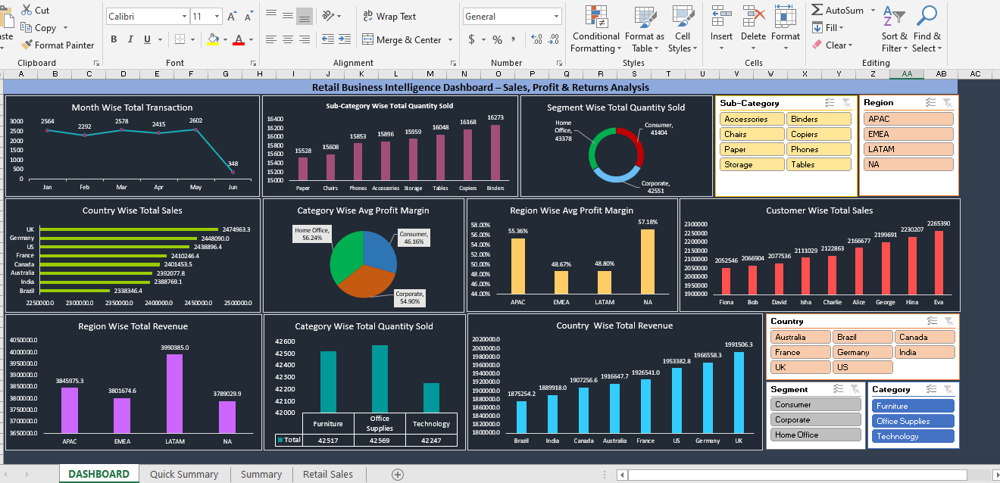

# Retail Sales Analysis 🛒📊

This project presents a retail business intelligence dashboard built using Microsoft Excel. It includes detailed insights on sales, profit, returns, and customer behavior.

---

## 📸 Excel Dashboard Preview

---

## 📊 Dashboard Highlights

- **Month-wise Transactions**
- **Country & Region-wise Total Sales**
- **Category-wise Profit Margins**
- **Customer-wise Sales Analysis**
- **Segment & Sub-category filters**

---

## 🛠 Tools Used

- Microsoft Excel  
  ➤ Pivot Tables  
  ➤ Charts & Graphs  
  ➤ Slicers & Filters  
  ➤ Dashboard formatting

---

## 📁 Files Included

- `retail_dashboard.png` – Excel dashboard image  
- `Retail_Sales_Analysis.xlsx` – (Upload Excel file if you want)

---

## 🔗 Author

**Yash Sharma**  
📧 ygsharma2222@gmail.com | 📍 Pune, India
Linkdin : [https://www.linkedin.com/in/yash-sharma-53069533a]
